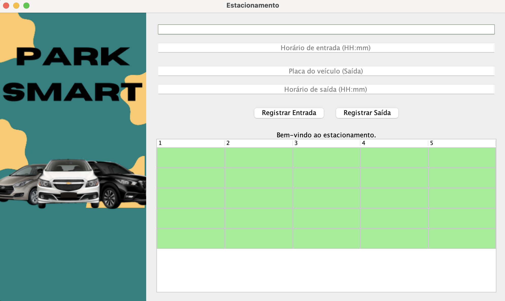

# ParkSmart

## Projeto Estacionamento

**ParkSmart** é uma aplicação desenvolvida em **Java Swing** que gerencia o estacionamento de veículos, calcula tarifas de acordo com o tempo de permanência e valida as placas de veículos provenientes da região Sul do Brasil (Paraná, Santa Catarina e Rio Grande do Sul). Com uma interface gráfica intuitiva e moderna, o sistema oferece uma solução prática e eficiente para o controle de vagas e cobrança de taxas.

⚙️ **Desenvolvido com:**

### Funcionalidades:
- **Cálculo de tarifa**: Calcula o valor da tarifa com base no tempo de permanência do veículo no estacionamento.
- **Validação de placa**: Verifica se a placa do veículo é válida conforme os intervalos alfanuméricos definidos para os estados do Paraná, Santa Catarina e Rio Grande do Sul.
- **Gestão de vagas**: Exibe em tempo real as vagas ocupadas e vagas livres no estacionamento, utilizando uma tabela interativa.
- **Interface gráfica**: Interface com botões estilizados, imagens e um layout intuitivo.

---

## Contribuidores

Este projeto foi desenvolvido como parte da disciplina de **Resolução da Natureza de Matemática Discreta** e contou com a colaboração dos seguintes contribuintes:

-  [Luma](https://github.com/lumab23)
-  [Amanda](https://github.com/Amandafonsecarodrigues)
-  [Kaylany](https://github.com/KaylanyVitoria)
-  [Raquel](https://github.com/raquelx99)

